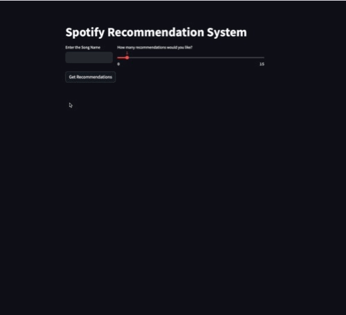

# Spotify Recommendation System

This project is a Spotify Recommendation System that uses K-Means clustering to provide recommendations based on the an input song's features. It also offers a user-friendly Streamlit user interface that allows you to input a song's name and the number of recommendations you desire.

## Features

- K-Means clustering on Spotify audio features.
- Streamlit user interface for an intuitive experience.
- Easy customization and extensibility.
- Quick and accurate song recommendations.

## Setup and Prerequisites

Before running the application, ensure you have the following dependencies installed:

- [Spotipy](https://spotipy.readthedocs.io/) (Python library for the Spotify Web API)
- [Streamlit](https://streamlit.io/) (for the user interface)
- Sci-Kit Learn
- Scipy
- Pandas

Export your Spotify API Credentials on your terminal, you can get them at https://developer.spotify.com 

```bash
export SPOTIFY_CLIENT_SECRET=xxx
export SPOTIFY_CLIENT_ID=xxx
```

To run the application -

```bash
streamlit run app.py
```

## Demo

<div align = "center">
<kbd>

</kbd>
</div>
